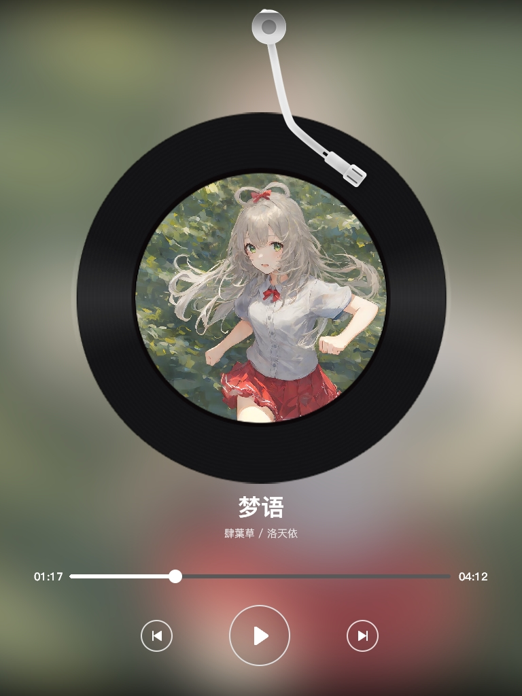

# 效果展示
<p align="center">
  
  
</p>

# 为了个人需求制作的小程序
不完全还原。<br />
生成的图片大小为 `1024*768`。<br />
包含一个自动将专辑封面转换成 `1000*1000` 大小的 Python 脚本（来自文心一言）。

# 使用方法
1. 将所有分辨率为 `1000*1000` 的 `jpg` 格式专辑封面放到程序目录下名为 `Input` 的文件夹中 (大小写敏感)。
2. 将文件命名为纯数字 (要用，可以顺手改成 songid)。
3. 在程序目录下创建名为 `songs.json` 的文件 (大小写敏感)，内容如下：
```json
{
    "songs": [
        {
            "id": 1984364208,
            "title": "永恒之上",
            "artist": "艾莉Anicca / 海底圆子",
            "length": "03:11"
        },
        {
            "id": 2007594653,
            "title": "梦语",
            "artist": "肆葉草 / 洛天依",
            "length": "04:12"
        },
        {
            ...
        }
    ]
}
```
其中 `id` 为文件名，`length` 为歌曲的总长度 (显示在进度条右侧)。默认的进度条在 `01:17`，根据自己需要修改代码。<br /><br />
&nbsp;&nbsp;4. 运行程序后，成品图片会保存到程序目录下 `Output` 文件夹中。
